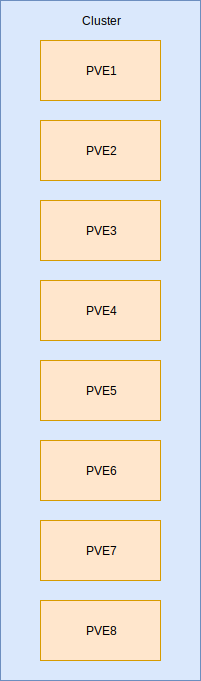

# ProxmoxStopAll
Simple script to stop all VMs on Proxmox Cluster

# How it work ?
The script is on the PVE1 with an apache2. All the files are in the folder /var/www/html (Not recommanded but not in production)
# What is needed ?
Proxmox VE and packages(On PVE1):
- sudo
- sshpass
- apache2
- php 
- libapache2-mod-php
# How to install
1. Install packages (apt install sudo sshpass apache2 php libapache2-mod-php)
2. Createan user "web" with a shell /bin/shell
3. Set "web" as the principal user of apache2 (/etc/apache2/envvars) and replace line:

export APACHE_RUN_USER=www-data
export APACHE_RUN_GROUP=www-data

by

export APACHE_RUN_USER=web
export APACHE_RUN_GROUP=web

4. Import file index.html, stopall.php and stopallvm.sh
5. Modify owner and permission:
- chown web stopallvm.sh
- chmod +x stopall.sh
# Modify script
In my exemple the IP are:
- 10.12.7.1 [PVE1]
- 10.12.7.2 [PVE2]
- ...
- 10.12.7.8 [PVE8]

And the password is proxmox(The same on all nodes)
- 
